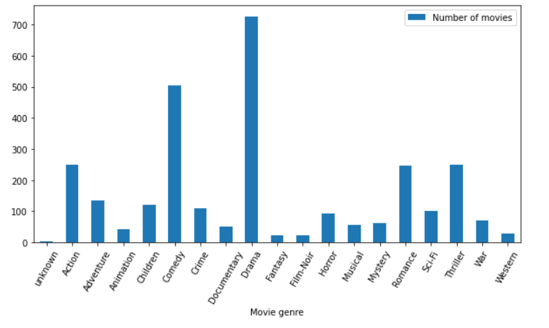
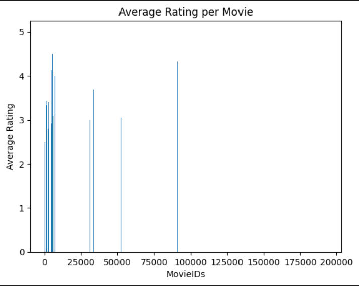
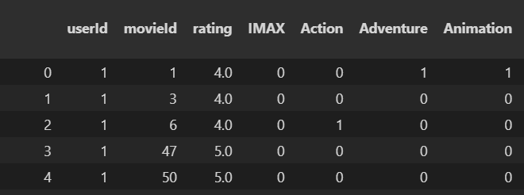
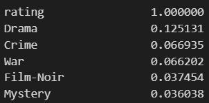
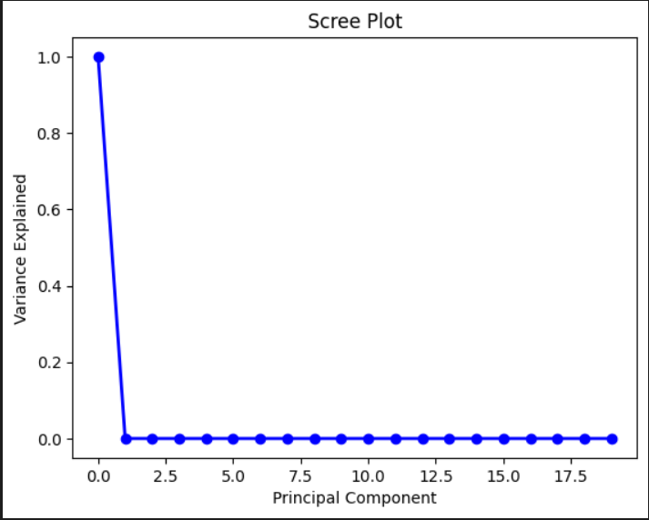

# Enhanced Media Recommendation

**Author: Beril Gurkas**

## Table of Contents
1) [Problem Statement](#problem-statement-and-rationale)
2) [Research Question](#research-question)
3) [Data Source](#data-sources)
4) [Model Objectives](#model-objectives)
5) [Methodology](#methodology)
    - [Data Preparation](#data-preparation)
    - [Modeling](#modeling)
        - [Clustering](#clustering-to-build-user-profiles)
        - [Principal Component Analysis](#dimensionality-reduction-with-principal-component-analysis)
        - [Collaborative Filtering](#collaborative-filtering-using-the-surprise-library)
6) [Results](#results)
    - [Pre-training](#pre-training)
    - [Post-training](#post-training)
        - [Baseline Model](#baseline-model)
        - [KNNRegressor](#k-nearest-neighbors-regressor)
        - [PCA](#principal-component-analysis)
        - [SURPRISE](#the-surprise-library)
7) [Conclusion](#conclusion)
8) [Next Steps](#next-steps)
9) [Outline of Project](#outline-of-project)
10) [Contact](#contact-and-further-information)

#### Executive summary: A media recommendation system that incorporates multiple factors such as genre, mood tags, and prior ratings

## Problem Statement and Rationale
As a user of media streaming platforms that incorporate recommender systems, some of their recommendations based on genre are pretty accurate. However, I would like to have the power to ask the media streaming platform about media that I feel like watching at that moment (it might be different from what I have been watching before/recently) without having to ask a search engine, since the media streaming platform would know my taste in media better than the search engine.

## Research Question
Can we build a media recommendation system that incorporates multiple factors such as genre, mood tags, and prior ratings to provide better recommendations to media service users and improve user retention?

## Data Sources
The MovieLens 100K dataset found [here](https://grouplens.org/datasets/movielens/).

The MovieLens dataset was chosen because it includes all of the points labeled for exploration in the Problem Statement, such as genres and mood tags defined by users. The dataset does not contain any missing values and aside from a slight skew towards the Drama and Comedy genres, it includes ratings for a wide variety of genres.

## Model Objectives
The approach for this project is two-fold:
- A supervised regression approach, in which the ratings given to the movies are predicted.
- An unsupervised collaborative filtering approach, where data from users' ratings are used to train arbitrary factors about the dataset to recommend new movies to users.

## Methodology
### Data Preparation
1) The data was found to not have any missing values.
2) The timestamp column was dropped, since no meaningful inference can be made from the time a movie was rated.

**Exploration:** Out of curiosity, the average rating per each movie was calculated. The result is as shown:

3) To build a baseline model, genre information about each movie was loaded and paired with the ratings table, so each row included information about the genre of the movie being rated as well.
>Since genre information was stored as a pipe-separated string in the raw dataset, this string was split and each genre was made into a dummy feature using One-Hot Encoding. (Shown below in truncated format)

4) Linear Regression was selected as the baseline model, which was a poor choice, since there wasn't a linear relationship between the features and the ratings.
5) A correlation matrix was built to examine the closeness of each feature to the rating feature, but none of the features (the genres) had any meaningful correlation with the rating. Some genres, however, were indeed more closely associated with a higher rating than others (such as Drama, Crime, and War movies.)

6) For the regression portion of this project, the data was split into training and test sets with Scikit-Learn's `train_test_split` method.

### Modeling
#### Clustering to Build User Profiles
***K-Nearest Neighbors for Regression*** with 50,000 neighbors was utilized to cluster similar rows together. The resulting model had a Mean Squared Error of 1.078.

#### Dimensionality Reduction with Principal Component Analysis
***Principal Component Analysis*** was performed to single out the most important features in the data.

As shown in the Scree Plot visualizer above, only the first few components had any meaningful insights to offer into the data. This conclusion is supported by the fact that the first 3 columns were User ID, Movie ID, and ratings, which offer the most variance in the data.

#### Collaborative Filtering Using the SURPRISE Library
The SURPRISE library is perfect for recommender systems. The ***Co-Clustering, KNN with Means, and SVD algorithms*** were used from this library.

A grid search was conducted to find the best combination of hyperparameters for Co-Clustering and SVD. Each of the algorithms were cross-validated across 5 folds in the data.

From these three algorithms, the SVD algorithm performed the best with the shortest training and testing times, as well as the lowest error. The results are evaluated below, in the Results section.

## Results
### Pre-training
- Ratings for the Movie IDs associated with each movie were found to be sparse. Not every Movie ID had been rated, and ratings seem centered around Movie IDs 0-12500.
- Genre data seems to be imbalanced in favor of more Drama and Comedy movies compared to other genres. This will introduce a bias if the model produced with this dataset were to be applied to a more balanced dataset.
- The ratings don't seem to be correlated too heavily with any of the genres.

### Post-training
#### Baseline Model:
>**Model:** Linear Regression

>**Evaluation Metric:** Standard Scoring

>**Accuracy:** 0.0419

The Baseline Linear Regression Model performed poorly since there is no linear relationship between the features and the ratings. The built-in scoring function was chosen as the evaluation metric, which yielded about 4% accuracy.

#### K-Nearest Neighbors Regressor
>**Model:** KNeighborsRegressor

>**Evaluation Metric:** Mean Squared Error

>**Mean Squared Error:** 1.078

The K-Nearest Neighbors algorithm was selected by keeping the fact that users can rate movies similarly in mind. This algorithm was used to predict the rating to be given to each movie by each user with a supervised regression task. It had a fairly low Mean Squared Error, which was selected as the evaluation metric since it is a common method for evaluation used with regression.

#### Principal Component Analysis
PCA did not yield evaluable predictions or results, but it did solidify User IDs, Movie IDs, and ratings as the top components to consider while training other models.

#### The SURPRISE Library
**Co-Clustering:**
>**Evaluation Metrics:** Root Mean Squared Error, Mean Absolute Error

>**RMSE:** 0.9558

>**MAE:** 0.7477

The Co-Clustering algorithm was selected for similar reasons as the K-Nearest Neighbors Regressor: to build clusters out of the given ratings in the dataset. GridSearch was used on the user and item cluster parameters to play with their tuning. The best number of user clusters (between 1-5) was determined to be 5, and the best number of item clusters (between 1-5) was determined to be 2. It had a slow training time but a fast testing time.

**KNN with Means:**
>**Evaluation Metrics:** Root Mean Squared Error, Mean Absolute Error

>**RMSE:** 0.9508

>**MAE:** 0.7493

The KNN algorithm was once again selected through a "wisdom-of-the-crowd" approach. Its default parameters were not changed, and the model was trained with the 40-neighbor default. It had a quick training time but longer test times. It had slightly better RMSE compared to Co-Clustering.

**SVD:**
>**Evaluation Metrics:** Root Mean Squared Error, Mean Absolute Error

>**RMSE:** 0.9248

>**MAE:** 0.7273

The Funk SVD algorithm had the best performance out of all of the models used across this project. It was selected because matrix factorization yields good results with recommendation tasks. Through GridSearch, the best parameters were found to be 1 factor, 30 epochs, non-biased training, and a learning rate of 0.01325. SVD had short training and testing times. It had the best RMSE by far.

## Conclusion
>**Best Model:** Funk SVD from the SURPRISE Library.

>**Error:** 0.9248

## Next steps
Due to time, computational, and knowledge limitations, the genres and mood tags could not be included much in the recommendation process despite being present in the research question. The next step would be to include these features in the predictions.

In order to make the data more scalable, a larger dataset such as the MovieLens 1M dataset, which also includes information about how strongly the user-defined tags relate to the movies they rated, can be used to train on.

Other machine learning models such as deep learning models could be considered to utilize all of the features at once. Due to computational limitations, the possibility of a deep learning model was not explored at this time.

## Outline of Project

- [Initial Exploration](eda.ipynb)
- [Baseline, KNN, and PCA Models](models.ipynb)
- [SURPRISE Library Models](surprise_models.ipynb)

### Contact and Further Information
Beril Gurkas
- bgurkas@uci.edu
- [LinkedIn](https://www.linkedin.com/in/berilgurkas/)
